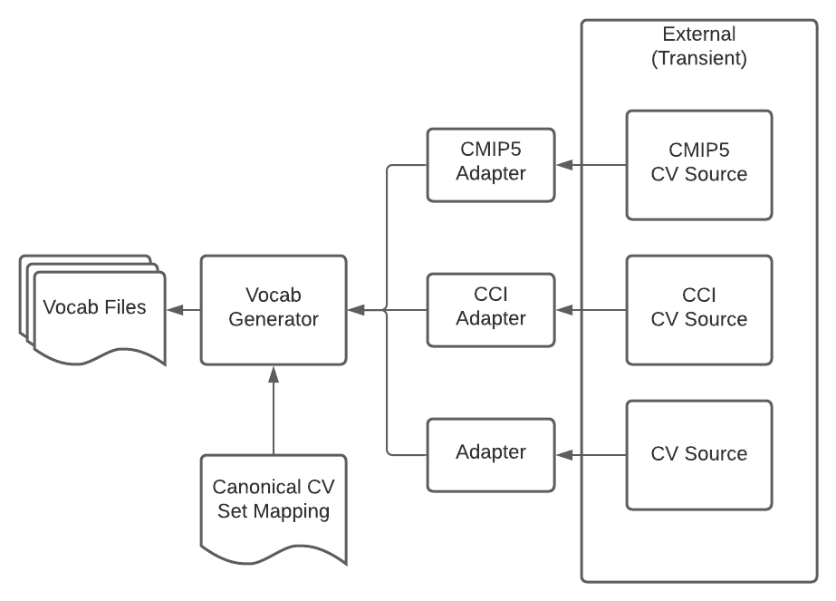

==========
STAC Vocab
==========

Retrieve controlled vocabularies from external sources to generate a local cache in a common format.

Construct a shared vocabulary which can map to one or more sub-vocabs.

Features
--------

* TODO

Credits
-------

This package was created with Cookiecutter_ and the `cedadev/cookiecutter-pypackage`_ project template.

.. _Cookiecutter: https://github.com/audreyr/cookiecutter
.. _`audreyr/cookiecutter-pypackage`: https://github.com/audreyr/cookiecutter-pypackage
